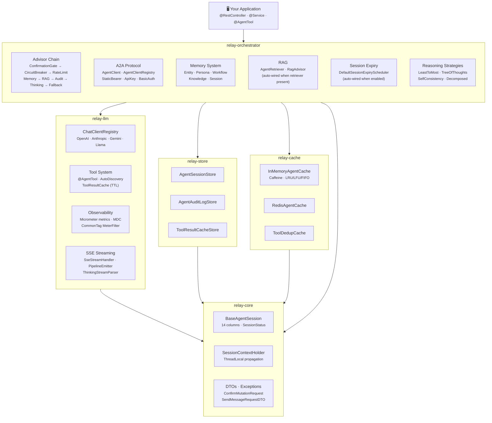
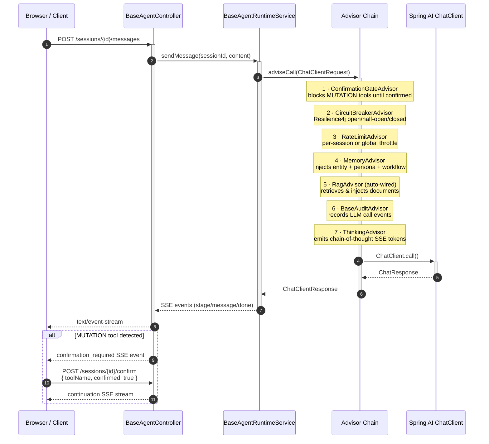

<div align="center">

# Relay

**Production-ready, extensible foundation for building AI agents on Spring AI**

[](https://openjdk.org/projects/jdk/21/)
[](https://spring.io/projects/spring-boot)
[](https://spring.io/projects/spring-ai)
[](LICENSE)

Relay is a Spring Boot library that gives you batteries-included scaffolding to build, run, and scale production AI agents — without writing the same boilerplate every time.

[Quick Start](#quick-start) · [Architecture](#architecture) · [Features](#features) · [Configuration](#configuration-reference) · [Extending](#extending-agent-core) · [Contributing](#contributing)

</div>

---

## Why Relay?

Building an AI agent from scratch means wiring together LLM calls, session state, audit logs, memory, tool caching, rate limiting, circuit breakers, SSE streaming, and multi-agent coordination. That is weeks of infrastructure work before you write a single line of business logic.

Relay gives you all of that — tested, observable, and extensible — as a set of focused Maven modules. You focus on what your agent *does*; Relay handles how it *runs*.

| Capabilty | What you get |
|---|---|
| 🧠 **5-tier memory system** | Entity facts · Persona profiles · Workflow memory · Knowledge base · Session context · **Durable File-based Persistence & Sandboxed AutoMemoryTools** |
| 🔗 **7 built-in advisors** | Rate limiting · Circuit breaker · RAG (auto-wired) · Memory injection · Confirmation gate · Audit · Thinking |
| 🤝 **Agent-to-Agent (A2A)** | HTTP-native protocol for multi-agent fan-out with SSE streaming and pluggable auth |
| 🗄️ **Swappable store backends** | In-memory (dev) → JPA → Redis → your own, zero code changes |
| 📊 **Full observability** | Micrometer metrics · common-tag filters · MDC logging · distributed tracing |
| 🛡️ **Production resilience** | Tool-result TTL caching · session checkpoints · mutation confirmation gates · auto session expiry |
| ⚡ **Java 21 virtual threads** | Non-blocking I/O throughout; no reactive boilerplate |
| 🧩 **Open SPI** | Plug in any LLM provider, vector store, auth contributor, retriever, or memory backend |

---

## Modules

Relay is structured as a multi-module Maven project. Import the BOM and pick exactly the modules you need.

| Module                                                     | Artifact ID              | What it contains                                                                        |
|------------------------------------------------------------|--------------------------|-----------------------------------------------------------------------------------------|
| [relay-bom](relay-bom/README.md)                   | `relay-bom`          | Bill of Materials — consistent version alignment across all modules                     |
| [relay-core](relay-core/README.md)                 | `relay-core`         | Domain model (`BaseAgentSession`, `BaseAuditLog`), DTOs, session context, exceptions    |
| [relay-cache](relay-cache/README.md)               | `relay-cache`        | Caffeine and Redis caching, tool-result TTL cache, deduplication                        |
| [relay-store](relay-store/README.md)               | `relay-store`        | Store interfaces, JPA adapters, Spring Data repositories, session checkpoints           |
| [relay-llm](relay-llm/README.md)                   | `relay-llm`          | ChatClient registry, prompt loading, SSE streaming, tool framework, observability       |
| [relay-orchestrator](relay-orchestrator/README.md) | `relay-orchestrator` | A2A protocol, 8 advisors, agent routing, memory, RAG, reasoning strategies, auto-config |

### Dependency management (recommended)

```xml
<dependencyManagement>
    <dependencies>
        <dependency>
            <groupId>io.github.shekharmaheswari85</groupId>
            <artifactId>relay-bom</artifactId>
            <version>1.0.7-SNAPSHOT</version>
            <type>pom</type>
            <scope>import</scope>
        </dependency>
    </dependencies>
</dependencyManagement>
```

`relay-orchestrator` transitively pulls in all other modules — the recommended single dependency for most teams:

```xml
<dependency>
    <groupId>io.github.shekharmaheswari85</groupId>
    <artifactId>relay-orchestrator</artifactId>
</dependency>
```

---

## Architecture

### Module dependency graph



### Request lifecycle — advisor chain sequence



### Module layout

```
io.relay
│
├── relay-core/
│   └── model/, session/, dto/, exception/
│
├── relay-cache/
│   └── cache/  (AgentCache, InMemoryAgentCache, RedisAgentCache, ToolDedupCache, DefaultToolResultCache)
│
├── relay-store/
│   └── store/, repository/, checkpoint/
│
├── relay-llm/
│   └── llm/, prompt/, stream/, tool/, aspect/, filter/, observability/, thread/
│
├── relay-orchestrator/
│   └── a2a/         (AgentClient, AgentClientRegistry, *A2AAuthContributor)
│       advisor/     (8 advisors incl. ConfirmationGateAdvisor, RagAdvisor)
│       config/      (RelayAutoConfiguration, RelayProperties)
│       executor/    (AgentExecutor, BaseAgentRuntimeService)
│       memory/      (AgentMemoryManager, EntityMemoryStore, PersonaStore)
│       rag/         (AgentRetriever, RagAdvisor, RetrievedDocument)
│       reasoning/   (LeastToMostSolver, TreeOfThoughtsExplorer, ...)
│       scheduler/   (BaseSessionExpiryScheduler, DefaultSessionExpiryScheduler)
│       web/         (BaseAgentController)
│
└── relay-bom/   (version BOM, no Java sources)
```

---

## Quick Start

### Prerequisites

- Java 21+
- Spring Boot 4.0.x
- Maven 3.8+

### 1. Import the BOM and add the orchestrator dependency

```xml
<dependencyManagement>
    <dependencies>
        <dependency>
            <groupId>io.github.shekharmaheswari85</groupId>
            <artifactId>relay-bom</artifactId>
            <version>1.0.7-SNAPSHOT</version>
            <type>pom</type>
            <scope>import</scope>
        </dependency>
    </dependencies>
</dependencyManagement>

<dependencies>
    <dependency>
        <groupId>io.github.shekharmaheswari85</groupId>
        <artifactId>relay-orchestrator</artifactId>
    </dependency>

    <!-- LLM provider of your choice -->
    <dependency>
        <groupId>org.springframework.ai</groupId>
        <artifactId>spring-ai-starter-model-openai</artifactId>
    </dependency>

    <!-- Optional: JPA persistence (recommended for production) -->
    <dependency>
        <groupId>org.springframework.boot</groupId>
        <artifactId>spring-boot-starter-data-jpa</artifactId>
    </dependency>
</dependencies>
```

### 2. Configure your LLM

```yaml
relay:
  llm:
    gateway-base-url: https://generativelanguage.googleapis.com
    api-key: ${GEMINI_API_KEY:}
    default-provider: google
    # Resilient multi-provider failover chains (mitigates rate limits)
    reasoning-models:
      - provider: google
        model: gemini-2.5-flash
        version: latest
        gateway-base-url: https://generativelanguage.googleapis.com
        api-key: ${GEMINI_API_KEY:}
      - provider: openai
        model: gpt-4o
        version: "2024-05-13"
        api-version: "2024-02-01"
        gateway-base-url: https://api.openai.com
        api-key: ${OPENAI_API_KEY:}
    utility-models:
      - provider: google
        model: gemini-2.5-flash
        version: latest
        gateway-base-url: https://generativelanguage.googleapis.com
        api-key: ${GEMINI_API_KEY:}
      - provider: openai
        model: gpt-4o-mini
        version: "2024-07-18"
        api-version: "2024-02-01"
        gateway-base-url: https://api.openai.com
        api-key: ${OPENAI_API_KEY:}
  
  # Durable, persistent file-based memories (survives app restarts)
  memory:
    type: file
    dir: ${user.home}/.superagent/memory
```

### 3. Define your session entity

```java
@Entity
@Table(name = "my_agent_sessions")
@Data
@SuperBuilder
@NoArgsConstructor
@EqualsAndHashCode(callSuper = true)
public class MyAgentSession extends BaseAgentSession {

    @Column(name = "customer_id")
    private String customerId;
}
```

### 4. Add your repository

```java
@Repository
public interface MySessionRepository
        extends BaseAgentSessionRepository<MyAgentSession> {
}
```

### 5. Expose your controller

```java
@RestController
@RequestMapping("/api/my-agent")
public class MyAgentController
        extends BaseAgentController<MyAgentSession, BaseCreateSessionRequest> {

    public MyAgentController(
            MyAgentRuntimeService runtimeService,
            ObjectProvider<TenantResolver> tenantResolver) {
        super(runtimeService, tenantResolver.getIfAvailable());
    }
}
```

Relay autoconfigures everything else: cache, memory manager, advisor chain, session expiry, observability, and virtual thread executor.

---

## Features

### Session Lifecycle

Every agent interaction lives inside a **session** — a durable unit of work that can be paused, resumed, checkpointed, and audited.

| Column             | Type        | Purpose                                                  |
|--------------------|-------------|----------------------------------------------------------|
| `session_id`       | `VARCHAR`   | External identifier (URL-safe, prefixed)                 |
| `agent_id`         | `VARCHAR`   | Which agent owns this session                            |
| `current_step`     | `VARCHAR`   | Workflow step enum value                                 |
| `status`           | `VARCHAR`   | `ACTIVE` · `PAUSED` · `COMPLETED` · `FAILED` · `EXPIRED` |
| `context_json`     | `CLOB`      | Full conversation history                                |
| `last_checkpoint`  | `VARCHAR`   | Step name to resume from                                 |
| `active_sub_agent` | `VARCHAR`   | Currently handling sub-agent                             |
| `auto_approve`     | `VARCHAR`   | JSON array of pre-approved tool names                    |
| `tenant_id`        | `VARCHAR`   | Multi-tenant isolation key                               |
| `created_at`       | `TIMESTAMP` | Immutable — set on insert                                |
| `updated_at`       | `TIMESTAMP` | Auto-refreshed on every save                             |

#### Automatic session expiry

Enable the built-in scheduler to expire idle sessions automatically (requires JPA):

```yaml
relay:
  session:
    expiry:
      enabled: true          # activates DefaultSessionExpiryScheduler
      idle-hours: 24         # sessions inactive >24h are marked EXPIRED
      check-interval-ms: 3600000  # sweep runs every hour
```

Override by declaring your own `BaseSessionExpiryScheduler<S>` bean for custom logic (e.g., closing SSE sinks, evicting caches on expiry).

---

### Memory System

Relay provides a **5-tier memory hierarchy** that persists knowledge across sessions and users.

| Type        | Scope           | Use case                                          |
|-------------|-----------------|---------------------------------------------------|
| `ENTITY`    | Cross-session   | Structured facts about products, users, locations |
| `PERSONA`   | Per-user        | Communication style, preferences, long-term goals |
| `WORKFLOW`  | Cross-session   | Past Q&A exchanges, learned patterns              |
| `KNOWLEDGE` | Global          | Domain facts, RAG-ingested documents              |
| `SESSION`   | Current session | Working memory, conversation-local state          |

#### Durable File-based Persistence (`FileBasedAgentMemoryManager`)
By default, memory is transient in-memory. By setting `relay.memory.type=file`, all memory entities, user personas, and past workflows are persisted as structured `.json` files under `sessions/{sessionId}` and `users/{userId}` subfolders of the configured memories directory. This ensures session state persists completely across restarts.

#### Sandboxed Agent Memory Tools (`AutoMemoryTools`)
Exposes the **Claude API / Claude Code sandboxed memory tools** specification directly as a first-class `@AgentTool` bean. Annotated with `requiresSession = true` and protected under MCP mutation guards, these tools allow the agent to self-curate its own persistent index (`MEMORY.md`) and topic files securely:
* `memoryView` — reads a file with line numbers or lists sandboxed folders 2 levels deep
* `memoryCreate` — creates a new memory file with YAML frontmatter
* `memoryStrReplace` — performs exact search-and-replace editing on memory files
* `memoryInsert` — inserts text lines at specific positions (essential for updating index lists)
* `memoryDelete` — recursively deletes files or folders
* `memoryRename` — renames or moves memory files

```java
// Persistence works out of the box
memory.remember(MemoryEntry.of(MemoryType.ENTITY, sessionId, userId, fact));
List<MemoryEntry> relevant = memory.recall(sessionId, userId, MemoryType.WORKFLOW, query, 5);
```

---

### Advisor Chain

Seven production-ready advisors that plug into Spring AI's `CallAdvisor` chain in a deterministic order:

```
ConfirmationGateAdvisor  — block MUTATION tools without user approval
CircuitBreakerAdvisor    — prevent cascading LLM failures (Resilience4j)
RateLimitAdvisor         — throttle per-session or globally
MemoryAdvisor            — inject persona + entity + workflow memory
RagAdvisor               — retrieve & inject relevant documents (auto-wired)
BaseAuditAdvisor         — record LLM call events
ThinkingAdvisor          — emit chain-of-thought SSE events
```

#### RagAdvisor — zero-config wiring

If your application declares an `AgentRetriever` bean, `RagAdvisor` is auto-configured with defaults (max 5 docs, no score threshold). Override to customise:

```java
@Bean
public RagAdvisor ragAdvisor(AgentRetriever retriever) {
    return RagAdvisor.builder(retriever)
            .maxDocuments(8)
            .minScore(0.75)
            .contextPrefix("--- KNOWLEDGE ---\n")
            .build();
}
```

---

### Tool System

```java
@AgentTool(category = ToolCategory.DISCOVERY)
public class OrderTools {

    @Tool(description = "Returns the current status for a given order ID")
    public OrderStatus checkOrderStatus(String orderId) { ... }
}

@AgentTool(category = ToolCategory.MUTATION, requiresSession = true)
public class OrderMutationTools {

    @Tool(description = "Cancels an order on behalf of the current session user")
    public CancelResult cancelOrder(String orderId) { ... }
}
```

`MUTATION` tools are intercepted by `ConfirmationGateAdvisor`. Tool results are automatically cached per `sessionId::toolName::inputHash`.

#### Tool result cache TTL

Tool results can expire on a different schedule from the rest of the cache:

```yaml
relay:
  cache:
    ttl: 30m        # all other cache entries
    tool-ttl: 5m    # tool results expire faster (live data)
```

---

### Confirmation Gate Protocol

When `ConfirmationGateAdvisor` blocks a `MUTATION` tool, the SSE stream emits a `confirmation_required` event containing the pending tool name. The UI should:

1. Display a confirmation prompt to the user.
2. `POST /sessions/{sessionId}/confirm` with the user's decision:

```http
POST /api/my-agent/sessions/sess-abc123/confirm
Content-Type: application/json
Accept: text/event-stream

{ "toolName": "cancel_order", "confirmed": true }
```

The framework synthesises a confirmation signal, re-runs the pipeline with `user_confirmed=true` in context, and streams back the continuation response. A rejection response is returned immediately without calling the LLM.

---

### Agent-to-Agent (A2A) Communication

HTTP-native protocol for multi-agent fan-out with SSE streaming.

```yaml
relay:
  a2a:
    enabled: true
    clients:
      inventory-agent:
        url: https://inventory-agent.example.com
        base-path: /api/agent
        response-timeout: 120s
```

#### Authentication

Three concrete `A2AAuthContributor` implementations are provided. Declare one (or more) as `@Bean` and they are automatically picked up by `AgentClientRegistry`:

```java
// Static Bearer token
@Bean
public A2AAuthContributor bearerTokenAuth(
        @Value("${inventory.token}") String token) {
    return new StaticBearerTokenA2AAuthContributor("inventory-agent", token);
}

// API key header (e.g. X-Api-Key)
@Bean
public A2AAuthContributor apiKeyAuth(
        @Value("${pricing.api-key}") String key) {
    return new ApiKeyA2AAuthContributor("pricing-agent", "X-Api-Key", key);
}

// HTTP Basic auth
@Bean
public A2AAuthContributor basicAuth(
        @Value("${fulfillment.username}") String user,
        @Value("${fulfillment.password}") String pass) {
    return new BasicAuthA2AAuthContributor("fulfillment-agent", user, pass);
}

// Multi-agent, one contributor
@Bean
public A2AAuthContributor allAgentTokens() {
    return StaticBearerTokenA2AAuthContributor.forAgents(Map.of(
            "inventory-agent",   System.getenv("INVENTORY_TOKEN"),
            "fulfillment-agent", System.getenv("FULFILLMENT_TOKEN")));
}
```

---

### SSE Streaming

`SseStreamHandler` provides smart chunking at sentence boundaries, sanitization, thinking events, confirmation detection, and cached replay — from LLM token to browser in one pipeline.

SSE event types emitted by the framework:

| Event type              | Description                                 |
|-------------------------|---------------------------------------------|
| `stage`                 | Agent processing stage label                |
| `message`               | Streamed text chunk                         |
| `thinking`              | Chain-of-thought token (ThinkingAdvisor)    |
| `tool_progress`         | Tool execution progress                     |
| `confirmation_required` | Mutation gate blocked — includes `toolName` |
| `follow_up_questions`   | Suggested follow-ups                        |
| `done`                  | Stream complete                             |
| `error`                 | Pipeline error                              |

---

### Observability

#### Metrics

| Metric                            | Type    | Tags                           |
|-----------------------------------|---------|--------------------------------|
| `relay.session.count`             | Counter | `event`, `agentId`             |
| `relay.llm.calls`                 | Counter | `provider`, `model`, `outcome` |
| `relay.llm.duration`              | Timer   | `provider`, `model`, `outcome` |
| `agent.tool.calls`                | Counter | `tool`, `outcome`              |
| `agent.tool.duration`             | Timer   | `tool`, `outcome`              |
| `agent.handoff.count`             | Counter | `from`, `to`                   |
| `relay.cache.operations`          | Counter | `operation`, `type`            |
| `agent.gate.confirmation.blocked` | Counter | —                              |

#### Common tags for dashboard filtering

```yaml
relay:
  metrics:
    common-tags:
      service: order-agent
      environment: production
      region: us-east-1
```

These tags are injected into every `agent.*` metric via a `MeterFilter` bean, leaving all other application metrics untouched.

#### Prometheus export

Add the dependency and expose the endpoint:

```xml
<dependency>
    <groupId>io.micrometer</groupId>
    <artifactId>micrometer-registry-prometheus</artifactId>
</dependency>
```

```yaml
management:
  endpoints:
    web:
      exposure:
        include: prometheus,health,info
  endpoint:
    prometheus:
      enabled: true
```

#### DataDog export

```xml
<dependency>
    <groupId>io.micrometer</groupId>
    <artifactId>micrometer-registry-datadog</artifactId>
</dependency>
```

```yaml
management:
  datadog:
    metrics:
      export:
        api-key: ${DATADOG_API_KEY}
        application-key: ${DATADOG_APP_KEY}
```

---

### Store Abstraction

All persistence sits behind narrow interfaces. Swap backends without changing framework code:

| Interface                 | Responsibility                      |
|---------------------------|-------------------------------------|
| `AgentSessionStore<S>`    | Create, read, list, delete sessions |
| `AgentAuditLogStore<A>`   | Append and query audit trail        |
| `ToolResultCacheStore<C>` | Cache and retrieve tool results     |

Built-in backends: **in-memory** (default), **JPA** (add `spring-boot-starter-data-jpa`), or **custom** (`@Bean` implementing the interface).

---

## Configuration Reference

```yaml
relay:

  # ── Cache ──────────────────────────────────────────────────────────────────
  cache:
    type: inmemory              # inmemory | redis
    ttl: 30m                    # global entry TTL
    tool-ttl: 5m                # tool result TTL override (optional)
    key-prefix: "relay:cache:"
    inmemory:
      max-entries: 10000
      eviction-policy: LRU      # LRU | LFU | FIFO
    redis:
      host: ${REDIS_HOST}
      port: 6379
      password: ${REDIS_PASSWORD:}
      pool:
        max-active: 10
        max-idle: 5
        min-idle: 1
    maintenance:
      enabled: false
      cleanup-cron: "0 0 * * * *"
      max-entry-age: 24h

  # ── Session ─────────────────────────────────────────────────────────────────
  session:
    id-prefix: "sess-"
    id-length: 12
    context-max-size: 1048576   # 1 MB
    expiry:
      enabled: false            # true → auto-expire idle sessions (JPA required)
      idle-hours: 24
      check-interval-ms: 3600000

  # ── Virtual Threads ──────────────────────────────────────────────────────────
  virtual-threads:
    enabled: true               # requires Java 21+

  # ── Metrics ──────────────────────────────────────────────────────────────────
  metrics:
    enabled: true
    common-tags:                # applied to all agent.* metrics
      service: my-agent
      environment: production

  # ── A2A ──────────────────────────────────────────────────────────────────────
  a2a:
    enabled: false
    connect-timeout: 10s
    clients:
      <logical-name>:
        url: https://...
        base-path: /api/agent
        response-timeout: 120s

  # ── LLM ──────────────────────────────────────────────────────────────────────
  llm:
    gateway-base-url: https://api.openai.com
    api-key: ${LLM_API_KEY}
    custom-headers:
      X-TENANT-ID: my-tenant
      X-PLATFORM: my-agent
    reasoning-model:
      provider: openai
      model: gpt-4o
      headers:
        X-CLIENT-ID: reasoning-client
    utility-model:
      provider: openai
      model: gpt-4o-mini
      headers:
        X-CLIENT-ID: utility-client
    system-prompts:
      default: classpath:prompts/system.txt
    ssl:
      trust-all: false
      ca-path: ${CA_BUNDLE_PATH:}
```

LLM header precedence (lowest to highest):

1. Provider defaults/auth headers (`LlmProvider`)
2. `relay.llm.custom-headers`
3. Per-model headers (`reasoning-model.headers`, `utility-model.headers`, `providers[].headers`)
4. `LlmGatewayHeadersContributor` beans

Later layers override earlier values for the same header key.

---

## REST Endpoints

`BaseAgentController` provides these endpoints out of the box. Subclass and annotate with `@RestController @RequestMapping` to expose:

| Method   | Path                      | Description                                       |
|----------|---------------------------|---------------------------------------------------|
| `POST`   | `/sessions`               | Create a new session                              |
| `POST`   | `/sessions/{id}/messages` | Send a message (SSE stream)                       |
| `POST`   | `/sessions/{id}/confirm`  | Confirm or reject a pending mutation (SSE stream) |
| `POST`   | `/sessions/{id}/resume`   | Resume a paused/failed session                    |
| `GET`    | `/sessions`               | List sessions (optional `?status=` filter)        |
| `GET`    | `/sessions/{id}`          | Get session status                                |
| `GET`    | `/sessions/{id}/audit`    | Get audit trail (optional `?eventType=` filter)   |
| `DELETE` | `/sessions/{id}`          | Delete a session                                  |
| `DELETE` | `/sessions`               | Bulk delete sessions                              |

---

## Extending Relay

### RAG — connect any vector store

```java
@Service
public class PineconeRetriever implements AgentRetriever {

    @Override
    public List<RetrievedDocument> retrieve(String query, Map<String, Object> context) {
        String tenantId = (String) context.getOrDefault("tenantId", "default");
        return pinecone.query(embed(query), 10)
                .stream()
                .map(v -> RetrievedDocument.of(v.getId(), v.getText(), v.getScore()))
                .toList();
    }
}
// That's all — RagAdvisor is auto-configured when this bean is present
```

### Custom session expiry scheduler

```java
@Component
public class MySessionExpiryScheduler extends BaseSessionExpiryScheduler<MySessionDO> {

    public MySessionExpiryScheduler(MySessionRepository repo) { super(repo); }

    @Override protected long getSessionExpiryHours() { return 12; }

    @Override protected List<String> getExpirableStatuses() {
        return List.of(SessionStatus.ACTIVE.name());
    }

    @Override protected String getExpiredStatus() {
        return SessionStatus.EXPIRED.name();
    }

    @Override
    protected void onSessionExpired(MySessionDO session) {
        sseRegistry.closeEmitter(session.getSessionId()); // custom cleanup
        super.onSessionExpired(session);
    }

    @Scheduled(fixedDelayString = "${relay.session.expiry.check-interval-ms:3600000}")
    public void runExpiry() { expireInactiveSessions(); }
}
```

### Custom store backend (e.g. MongoDB)

```java
@Bean
public AgentSessionStore<MySession> mongoSessionStore(MongoTemplate mongo) {
    return new MongoAgentSessionStore<>(mongo, MySession.class);
}
```

### Multi-tenant session isolation

```java
@Component
public class HeaderTenantResolver implements TenantResolver {

    @Override
    public String resolve(HttpServletRequest request) {
        return request.getHeader("X-Tenant-ID");
    }
}
```

### Custom advisor

```java
@Component
@Order(Ordered.HIGHEST_PRECEDENCE + 15)
public class TokenBudgetAdvisor implements CallAdvisor {

    @Override
    public String getName() { return "token-budget-advisor"; }

    @Override
    public ChatClientResponse adviseCall(
            ChatClientRequest request, CallAdvisorChain chain) {
        enforceTokenBudget(request);
        return chain.nextCall(request);
    }
}
```

### Advanced reasoning strategies

| Strategy         | Class                    | When to use                                |
|------------------|--------------------------|--------------------------------------------|
| Least-to-most    | `LeastToMostSolver`      | Multi-step decomposition                   |
| Self-consistency | `SelfConsistencyRunner`  | High-stakes decisions (majority vote)      |
| Tree-of-thoughts | `TreeOfThoughtsExplorer` | Exploratory / creative tasks               |
| Decomposition    | `DecomposedPromptRunner` | Complex queries with independent sub-tasks |

---

## Test Utilities

`relay-store` ships in-memory implementations of all store interfaces:

```java
@SpringBootTest
class MyAgentServiceTest {

    @Autowired InMemoryAgentSessionStore<MySession> sessionStore;
    @Autowired InMemoryAgentAuditLogStore<MyAuditLog> auditLogStore;
    @Autowired InMemoryToolResultCacheStore<AgentToolResultCacheDO> cacheStore;

    @AfterEach void cleanup() {
        sessionStore.clear();
        auditLogStore.clear();
        cacheStore.clear();
    }
}
```

`relay-llm` provides `MockChatModel` (returns pre-scripted responses in sequence) and `SseEventCaptor` for asserting on streamed events.

---

## Contributing

### Build

```shell
# Full CI build with static analysis
mvn verify

# Skip static analysis for faster local iteration
mvn verify -Dspotbugs.skip=true -Dpmd.skip=true

# Build a single module and its dependencies
mvn verify -pl relay-llm --also-make

# Run static analysis standalone
mvn spotbugs:check
mvn pmd:check
mvn pmd:cpd-check
```

### Release

Releases are fully automated via GitHub Actions. Go to **Actions → Release → Run workflow**, pick the bump type (`patch` / `minor` / `major`), and click **Run**. No local steps required.

### Code standards

- **Java 21** — prefer records, sealed classes, pattern matching, and virtual threads
- **Lombok** — use `@Data`, `@SuperBuilder`, `@RequiredArgsConstructor` consistently; never mix `@Builder` and `@SuperBuilder` in an inheritance hierarchy
- **Javadoc** — all `public` interfaces and classes require full Javadoc
- **Static analysis** — SpotBugs + PMD must pass before merging (`mvn verify`)
- **Tests** — new features require unit tests using in-memory store utilities from `relay-store`

Exclusion rules live in `spotbugs-exclude.xml` and `pmd-ruleset.xml`. Do not add `@SuppressWarnings` to production code to silence analysers.

---

## License

Relay is currently a private personal project.

Copyright 2026 Shekhar Maheswari. All rights reserved.
